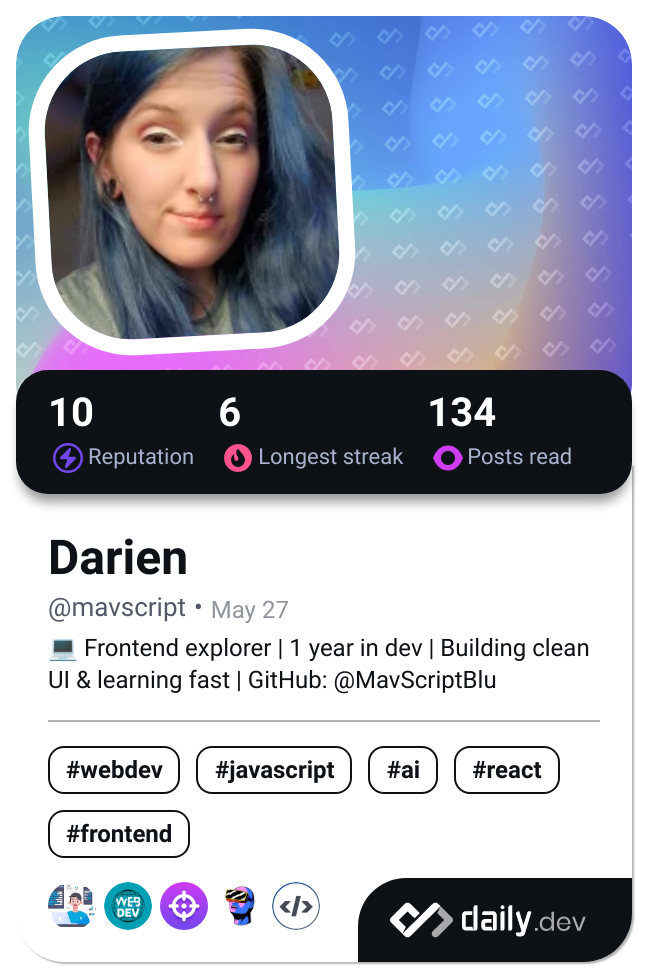

# Hi there 👋 I'm Blue, a software developer with a knack for problem-solving and a passion for learning. 🌟

## About Me
I'm based in Wisconsin and enjoy working on various projects that challenge my skills and expand my knowledge. I'm particularly interested in web development, software engineering, and anything related to coding. When I'm not coding, you can find me exploring new technologies, reading, or enjoying the great outdoors.

## Technologies and Tools
Here are some of the technologies and tools I work with:
- **Languages**: JavaScript, HTML, CSS
- **Frameworks and Libraries**: React, Node.js, Express
- **Tools and Platforms**: Git, GitHub, VSCode
- **Other Skills**: Form Validation, Object-Oriented Programming (OOP)

 

## Projects

### Simple Todo App
- A user-friendly Todo application designed for efficient task management.
- **Features**:
  - Form validation ensures valid input for task names and optional due dates.
  - Unique IDs assigned to tasks using the `uuid` package for precise identification.
  - Add & delete todos seamlessly.
- **Technologies**:
  - JavaScript (ES6+): Modern coding practices with classes and modules.
  - HTML & CSS: Clean and responsive user interface design.
  - Modular structure for organized components.
- **Deployment**: Live on GitHub Pages for easy access and demo:  
  [View Project](https://github.com/iiBamBlue/se_project_todo-app)

### SE Project Spots
- A project showcasing unique spots through creative and interactive designs.
- **Recent Updates**:
  - Fully responsive design for both desktop and mobile views.
  - Improved CSS and layout for the delete modal.
  - Enhanced functionality for the avatar edit button across all screens.
- Highlights advanced CSS techniques and JavaScript integration for dynamic user experiences.  
[View Project](https://github.com/iiBamBlue/se_project_spots)

### Craft & Brew Cafe
- A beautifully designed coffee shop website created as part of my Software Engineering journey.
- **Key Features**:
  - Semantic HTML5 ensures accessibility and proper structure for the website.
  - CSS animation & transformations add engaging visual effects and interactivity.
  - Custom form design crafted with attention to usability and aesthetics.
  - Flat BEM file structure ensures organized, scalable, and easy-to-maintain code.
- **Recent Updates**:
  - Updated the site's title and hover colors in the navigation.
  - Enhanced design, including personalized "recipes" and plans for mock videos.
  - Renamed the coffee shop and added a unique slogan and description.
- **Deployment**: Live hosting via GitHub Pages for seamless user experience.  
  [View Project](https://github.com/iiBamBlue/se_project_coffeeshop)

## Get in Touch
Feel free to reach out if you have any questions, collaboration ideas, or just want to say hi!  
Link Removed for Security
